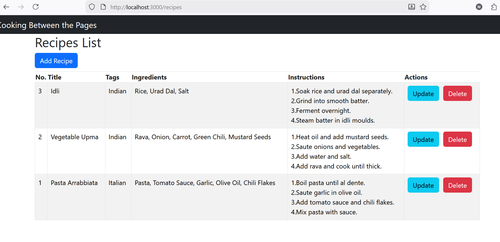
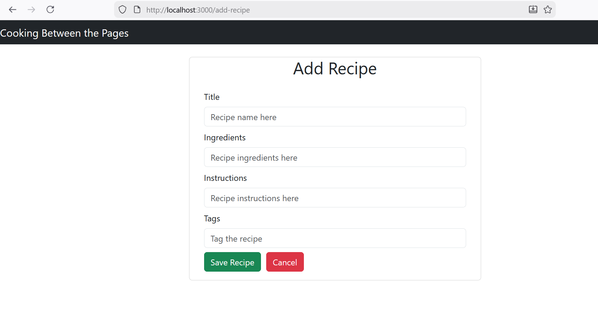
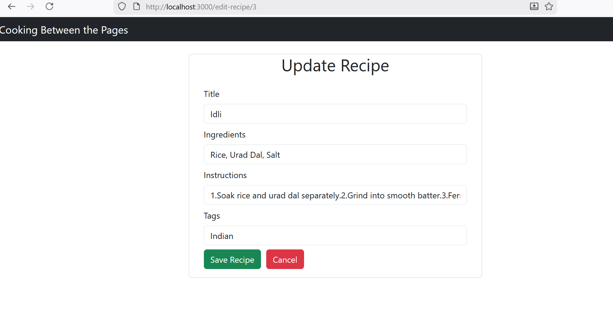

# 🍽️ Recipe Collection – Full Stack CRUD Application
A full-stack Recipe Collection web application built using Spring Boot (backend) and React (frontend).
The application allows users to create, view, update, delete, and manage recipes with ingredients, instructions, and tags.

This project demonstrates end-to-end CRUD functionality, REST API integration, and frontend–backend communication.

## Features:
- Create, update, delete, and view recipes.
- Store recipe details with title, ingredients and instructions
- Tag recipes (vegan, desserts, quick)
- Responsive React UI
- Clean separation of frontend and backend layers

## Tech Stack:
# Backend
- Java
- Spring Boot
- Spring Web (REST APIs)
- Spring Data JPA
- Hibernate
- H2 Database
- Maven
# Frontend
- React
- Axios
- React Hooks (useState, useEffect)
- HTML / CSS

## Architecture:
Frontend (React)
     |
     | REST API (JSON)
     |
Backend (Spring Boot)
     |
Database (H2)

## Screenshots:
### Recipe List

### Add Recipe

### Edit Recipe

## How to run:
# Backend
cd backend
mvn spring-boot:run
Backend runs on: http://localhost:8080
# Frontend
cd frontend
npm install
npm start
Frontend runs on: http://localhost:3000

## API Endpoints:

| Method | Endpoint          | Description       |
| ------ | ----------------- | ----------------- |
| GET    | /api/recipes      | Get all recipes   |
| GET    | /api/recipes/{id} | Get recipe by ID  |
| POST   | /api/recipes      | Create new recipe |
| PUT    | /api/recipes/{id} | Update recipe     |
| DELETE | /api/recipes/{id} | Delete recipe     |

## Future Goals:
- Global exception handling using @ControllerAdvice
- OAuth 2.0 / JWT authentication
- Role-based access control
- Dockerization
- Kubernetes deployment
- CI/CD pipeline (GitHub Actions)

